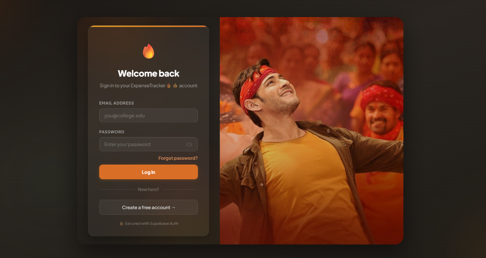
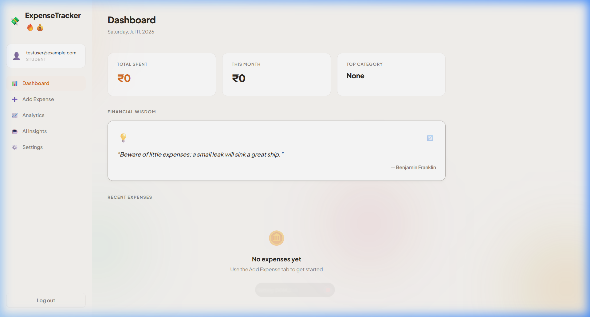

# 💰 ExpenseTracker🔥💰

A high-fidelity, responsive personal expense tracker for college students — built with a **FastAPI** backend, a **Vanilla HTML/CSS/JS Single Page Application (SPA)** frontend, **Supabase Auth & Database**, and **Llama 3 (via Groq API)**.

🔗 **Live Demo:** https://expense-tracker-et8a.onrender.com
📦 **Repo:** [github.com/vishnureddy1210/expense-tracker](https://github.com/vishnureddy1210/expense-tracker)
   

---

## 🎨 Visual Interface

### 1. Modern Login Portal
Features smooth HSL floating orbs and glassmorphism styling.


### 2. Main Dashboard (with Financial Wisdom Banner)
Displays quick metrics cards, rotating wisdom advice at the top, and real-time transaction updates.


---

## ✨ What's New in v2 (FastAPI SPA Migration)

| Feature | v1 (Streamlit Legacy) | v2 (FastAPI + HTML/CSS/JS SPA) |
|---|---|---|
| **Architecture** | Streamlit Rerender Loop | **FastAPI API Server** + **Independent Frontend** |
| **UX & Layout** | Python-based tab panels | **Smooth client-side SPA** (Dashboard, Add Expense, Analytics, AI, Settings) |
| **Wisdom Quotes** | ❌ | **Dynamic Financial Wisdom Banner** at the top of the dashboard with manual shuffle |
| **Charts** | Matplotlib static charts | **Interactive Chart.js** (Donut categories & MoM bar) |
| **AI Insights** | Static Claude completions | **Streaming Groq AI Insights** block-by-block |
| **Theming** | Basic Streamlit toggle | **Persistent Dark/Light Mode** via custom CSS variables & localStorage |

---

## ✨ Features

- 🔐 **Secure Auth**: Sign up, login & password reset flow via Supabase Auth.
- 💡 **Financial Wisdom Banner**: A card at the top of the dashboard displaying rotating saving quotes that can be refreshed with a 🔄 button.
- 📊 **Main Dashboard**: Real-time totals (Total Spent, This-Month Spent, Top Category) and a detailed scrollable list of recent transactions.
- 🍩 **Visual Analytics**: Interactive spending breakdowns by category (Donut Chart) and Month-over-Month charts using Chart.js.
- 📅 **Top Expenses**: Auto-calculated biggest purchases table to pinpoint where high-ticket funds are going.
- 🤖 **Streaming AI Insights**: Groq analyzes database records and streams personalized budgeting tips and wasteful spend warnings directly.
- 🗑️ **Management**: Instantly delete individual expenses.
- 📥 **Data Portability**: Export all logged expense history into a clean CSV format.
- 🎨 **Appearance Settings**: Custom theme switcher that toggles light and dark modes with transition effects.

---

## 🛠️ Tech Stack

| Layer | Component / Tool |
|---|---|
| **Frontend** | Vanilla HTML5 / Custom CSS3 (HSL Variables) / ES6 JavaScript |
| **Client Libraries** | Supabase JS Client SDK & Chart.js (Loaded via CDN) |
| **Backend API** | FastAPI (Python 3.10+) served via Uvicorn |
| **Database** | Supabase (PostgreSQL with RLS policy isolation) |
| **Auth Provider** | Supabase GoTrue Auth |
| **AI Engine** | Llama 3.3 70B via Groq API (Streaming response) |

---

## 📁 Project Structure

```
expense-tracker/
├── server.py            # FastAPI backend (API endpoints & static file hosting)
├── static/              # SPA Frontend Assets
│   ├── index.html       # Single Page Application HTML layout
│   ├── style.css        # Layouts, typography, theme tokens & card designs
│   ├── app.js           # Client auth, Chart.js integrations & API calls
│   └── callback.html    # Password reset callback page (hash fragments)
├── requirements.txt     # Python backend dependencies
├── package.json         # Node metadata (used for local IDE Intellisense / Supabase client autocomplete)
├── .env                 # Local environment secrets (do not commit!)
└── README.md            # Project documentation
```

---

## 🚀 Run Locally

### 1. Clone & Install Dependencies

```bash
git clone https://github.com/vishnureddy1210/expense-tracker.git
cd expense-tracker
python -m venv venv
source venv/bin/activate      # macOS/Linux
# venv\Scripts\activate       # Windows
pip install -r requirements.txt
```

### 2. Set Up Supabase Database

Create a project at [supabase.com](https://supabase.com), open the **SQL Editor**, and execute the following schema to create the table and establish Row Level Security (RLS):

```sql
CREATE TABLE expenses (
  id UUID DEFAULT gen_random_uuid() PRIMARY KEY,
  user_id UUID REFERENCES auth.users(id),
  item TEXT NOT NULL,
  amount NUMERIC NOT NULL,
  category TEXT,
  date DATE,
  created_at TIMESTAMP DEFAULT now()
);

ALTER TABLE expenses ENABLE ROW LEVEL SECURITY;

CREATE POLICY "Users manage own expenses"
ON expenses FOR ALL TO authenticated
USING (auth.uid() = user_id)
WITH CHECK (auth.uid() = user_id);
```

### 3. Configure the Environment

Create a `.env` file in the project root:

```env
SUPABASE_URL=https://your-project-id.supabase.co
SUPABASE_KEY=your-anon-public-key
GROQ_API_KEY=your-groq-api-key
SITE_URL=http://localhost:8502/callback.html
```

> **Get your free Groq API key** at [console.groq.com](https://console.groq.com).

### 4. Launch the Server

Run the FastAPI backend which will serve the API endpoints and the frontend:
```bash
venv\Scripts\python.exe server.py   # Windows
# python server.py                  # macOS/Linux
```

Open [http://localhost:8502](http://localhost:8502) in your browser.

---

## ☁️ Deploy to Hugging Face Spaces or Render (Docker SDK)

To host this FastAPI app on Hugging Face Spaces or Render, create a service with the **Docker** SDK and include this port-flexible `Dockerfile` in the root:

```dockerfile
FROM python:3.11-slim
WORKDIR /code
COPY ./requirements.txt /code/requirements.txt
RUN pip install --no-cache-dir --upgrade -r /code/requirements.txt
COPY . .
CMD uvicorn server:app --host 0.0.0.0 --port ${PORT:-7860}
```

Remember to add your `.env` variables (`SUPABASE_URL`, `SUPABASE_KEY`, `GROQ_API_KEY`) as environment variables/secrets in the settings.

---

## 🔬 Testing & Verification

To verify that the application and integrations run correctly, perform the following validation steps:

### 1. Backend Endpoint Health Checks
* **Config Check**: Send a GET request to `/api/config` to verify Supabase environment variables are loaded and exposed.
* **AI Analysis Stream**: Send a POST request to `/api/insights` with mock expense payload data to verify streaming chunks return successfully from the Groq completions engine.

### 2. Manual E2E Verification
* **Authentication**: Confirm signup creates an entry in Supabase, and login sets the active JWT session. Try the **Password Reset** flow (using the `/callback.html` redirection) to confirm site URLs redirect correctly.
* **CRUD Flow**: Add a test expense, confirm it displays immediately in the recent list with currency formatting, update analytics displays, and delete it to verify reactivity.
* **CSV Export**: Click the CSV export button and verify file downloads with escaping for special characters in expense names.

---

## 🧠 Interview Prep: Resilience & Edge Cases

When asked about how **ExpenseTracker** handles anomalies, reference these architectural decisions:

* **Groq API / Llama 3 Outages**: If the AI model is down or rate-limited, the `/api/insights` endpoint returns a clear `500` error block with specific exception logs. The frontend JavaScript handles this response, enables the "Generate Insights" button, and alerts the user via a red toast banner instead of freezing the UI.
* **Supabase Session Expirations & Network Dropping**: The app implements JWT expiration checks. If Supabase Auth tokens expire or connectivity is disrupted, operations catch standard SDK exceptions and show alerts.
* **CSRF and Access Controls**: Database reads/writes do not rely on local variables. PostgreSQL Row Level Security (RLS) guarantees that users can only read, update, or delete data belonging directly to their Supabase user ID, even if custom request headers are spoofed.

---

## 📄 License

MIT — Free to use, adapt, and build upon.
